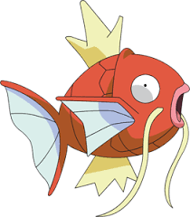

```{r setup, include=FALSE}
knitr::opts_chunk$set(echo = FALSE)
library(plotly)
library(parallel)
library(ggplot2)
library(tidyr)
library(dplyr)
library(linprog)
library(quadprog)
library(nloptr)
```

## Why R?

- Open source
- Collaborative
- Great documentation
- "Fast and furious"


## Step 0

- R is the lenguaje
- I recommend R Studio as the IDE

## Why R Studio

- Easy usage
- Shiny, R markdown and R notebooks
- Better looking! (looks like Spyder for Python or Matlab)


## Guideline

- Some syntax
- Some useful functions (Special attention to apply and parapply)
- How to deal with data.frame, matrix or lists
- Data manipulation (dplyr and tidyr)
- ggplot2 and plotly.
- Lets use some optimization packages (Here we will see the GLM)
- r Markdown
- Lets make our App using Shiny 

## Ready 

- How to install R.
- How to install R studio.
- Lets see the command line.
- Open our very first script.

## If


```{r, echo=TRUE}

rIsCool=TRUE

if(rIsCool){
  print("Hell yes, r is pretty cool")
}

```

## The else part


```{r, echo=TRUE}

rIsCool=TRUE
rSucks=FALSE
if(rIsCool && rSucks ){ # here we use the and operator
  print("nope")
}else{
  print("Someone is lying")
}

if(rIsCool || rSucks ){
  print("nope")
}else{
  print("My very first or")
}

```

## The else part II 

```{r, echo=TRUE}

rIsCool=TRUE
rSucks=FALSE
if( rSucks ){
  print("nope")
}else if(rIsCool){
  print("where the heck is elif")
}

```


## While

Lets make a loop that goes from 1 to 10 printing only the prime numbers.

```{r, echo=TRUE}

primes=c(2,3,5,7)# This is how we concatenate variables, the c function (we'll see it later)
i=1
while(i<10){
  if( i%in%primes ){ #the command %in% could be really useful
    print(i)
  }
  i=i+1
}

```


## For

Lets make a loop that goes from 1 to 10 printing only the prime numbers.

```{r, echo=TRUE}

primes=c(2,3,5,7)# This is how we concatenate variables, the c function (we'll see it later)
i=1
for(i in 1:10){
  if( i%in%primes ){ #the command %in% could be really useful
    print(i)
  }
}

```

## User defined functions.

Let's make the sum function

```{r, echo=TRUE}

MyFirstTime=function(a,b){
  res=a+b
  return(res)
}
a=42
b=54
print(MyFirstTime(a,b))
print(a+b)

```


## User defined functions II

Let's make the sum function.

But... if we don't define the second argument it should be 11

```{r, echo=TRUE}

MyFirstTimeLikeAPro=function(a,b=11){
  res=a+b
  return(res)
}
a=42

print(MyFirstTimeLikeAPro(a))

```


## User defined functions III

Let's make the sum function.

But... if we don't define the second argument it should be a random number (use the command floor(runif(1)*10)).

Return the b argument in case that it was not defined (aditional to the sum)

## User defined functions III
```{r, echo=TRUE}

ICanHandle2=function(a,b=NULL){
  if(is.null(b)){ #another useful function: is.null
    b=floor(runif(1)*10)
    res=a+b
    res2=list(sum=res,b=b) #You can return also c(res,b) but using lists is a good option
    return(res2)
  }else{
    res=a+b
    return(res)
  }
}


```


## User defined functions III
```{r, echo=TRUE}
a=42
r=ICanHandle2(a)
print(r$sum)
print(r$b)

```


## Let's make an array

An array is a variable were we can storage any kind of variables (they must be the same type, for instance,  strings or integers).

myArray=c(var1,var2)
myArray2= c(myArray,var3)

if we want to use a variable inside an array we use the variable index (R index from 1)


## My first array


```{r, echo=TRUE}
var1=42
var2="Hola"
var3=52
arr1=c(var1,var2) # This works... but var1 became a string
arr2=c(var1,var3) # Both are numbers, and they stay as numbers
```

## Useful functions 

- Concatenate: c(array1,array2,...,arrayn)
- Length: length(array)
- All but an specific element: array[-index]
- Get type of data: str(array)
- Get unique elements: unique(array)


## Useful functions (numeric arrays)

- Mean: mean(array)
- Median: median(array)
- Min: min(array)
- Max: max(array)
- Standar deviation: sd(array)
- Variance: var(array)


## Let's make a Matrix

A matrix is a variable were we can storage any kind of variables (they do  have to be the same type: we can storage, for instance,  strings and integers) using a double index.

myMatrix=matrix(array, ncol=n , byrow=T)

The idea here is that we fill a matrix of n columns using with the data in the array. We fill the matrix row by row if we define byrow=T.

if we want to use a variable inside an matrix we use a double variable index [row,column]


## My first Matrix


```{r, echo=TRUE}
array=c("hola","mundo","hello","world")
m1=matrix(array,ncol=2)
array2=c(1,2,3,4)
m2=matrix(array2,ncol=2,byrow = T)
print(m2)
```

## Useful functions 

- Column binding: cbind(mat1,mat2...matn) 
- Row binding: rbind(mat1,mat2...matn) 
- Get the dimension of a matrix: dim(mat)
- Transpose: t(mat)
- Select a whole row or column: matrix[row,] or matrix[,column]
- Matrix multiplication: mat1 %*% mat2
- Element wise multiplication (or sum): mat1 * mat2 or mat1 + mat2


The last 2 functions apply only for numeric matrix.
Be careful with dimension problems!!!


## Useful functions II


```{r, echo=TRUE}
array=c(3,2)
m1=matrix(array,ncol=2) #dim 1x2
array2=c(1,2,3,4)
m2=matrix(array2,ncol=2,byrow = T) #dim 2x2
#m3=cbind(m1,m2) Dimensional problem!
m3=rbind(m1,m2)
print(m3)
```


## Useful functions III


```{r, echo=TRUE}
array=c(3,2)
m1=matrix(array,ncol=2) #dim 1x2
array2=c(1,2,3,4)
m2=matrix(array2,ncol=2,byrow = T) #dim 2x2
#m3=m2 %*% m1 Dimensional problem!
m3=(m2+m2) %*% t(m1) 
print(m3)
```

## Extra packages

R has a lot of contributors, the CRAN has a lot of extra packages that allow us to do a lot of extra things!! (with little extra effort)

- To install the package ggplot2(or any other) the command is: install.packages("ggplot2")
- To load the package ggplot2(or any other) the command is: library(ggplot2)


## Using lists

A list is a variable were we can storage any kind of variables (they do not have to be the same type: we can storage, for instance,  strings and integers).

mylist=list(name1=var1,name2=var2)

if we want to use a variable inside a list we use the $ operator, or access with its index[[index]]


## My first list

```{r, echo=TRUE}
var1=42
var2="Hola"
myList=list(name1=var1,name2=var2)
print(myList)
```


## Using data frames

A data frame is used for storing data tables. It is a list of arrays of equal length

DF=data.frame(name1=arr1,name2=arr2)

if we want to use an array inside a data frame we use the $ operator 


## My first data frame

```{r, echo=TRUE}
array=c("hola","mundo","hello","world")
array2=c(1,2,3,4)
DF=data.frame(name1=array,name2=array2)
print(DF)
```

## Indispensable functions

- head(DF,n): see the first n rows of a dataframe DF (by default n=5)
- tail(DF,n): see the last n rows of a dataframe DF (by default n=5)
- str(DF): a description of the type of data in each array (column)
- colnames(DF): give us the names of the arrays in the dataframe DF
- colnames(DF)=newNames: set the names of the arrays in DF equals to newNames 
- rownames(DF): give us the names of each row in the dataframe DF
- rownames(DF)=newNames: set the rownames of each row in DF equals to newNames 

We can apply almost every function of a matrix here (not the ones design for numerical matrix)

## Useful package: magrittr


## Use magrittr

- x %>% f is equivalent to $f(x)$
- x %>% f(y) is equivalent to $f(x, y)$
- x %>% f %>% g %>% h is equivalent to $h(g(f(x)))$

## Useful package: dplyr

See the dplyr package: Grammar of data Manipulation. Some important functions are:


## Useful functions: dplyr
- mutate
- group_by and ungroup
- summarise
- filter
- left_join
- select

## select

Here we select which columns we want to use.

```{r, echo=TRUE}
iris%>%
  select(Petal.Width,Species)%>%
  head()
```


## Mutate 

Add a column to a Data Frame

```{r, echo=TRUE}
iris%>%
  mutate(new_column="hi!")%>%
  head()
```

## Summarise
Get the summary of a data frame i.e mean, median, min

```{r, echo=TRUE}
iris%>%
  summarise(mean_Sepal.Length=mean(Sepal.Length),
            min_Petal.Width=min(Petal.Width))
```

## group_by
This functions is like...


## Let's use it as a Gyarados

What if we want to know which is the mean of the Petal.Width but for EACH Species?

```{r, echo=TRUE}
iris%>%
  group_by(Species)%>%
  summarise(mean_Petal.Width=mean(Petal.Width))
```


## Let's use it as a Gyarados

What if we want to know which is the mean of the Petal.Width but for EACH Species?

```{r, echo=TRUE}
iris%>%group_by(Species)%>%
  summarise(mean_Petal.Width=mean(Petal.Width))
```

## Left_Join

It is like vlookup in excel (EWWW excel). Here we merge two data frame according to a column key.

Let's try to put the mean_Petal.Width in each row of the original data frame.

```{r, echo=TRUE}
mean.df=iris%>%group_by(Species)%>%
  summarise(mean_Petal.Width=mean(Petal.Width))
iris%>%left_join(mean.df,by="Species")%>%
  head()
```

## filter

Here we can filter a data frame according to a logical condition. Let's try to get a data frame with only the rows where the  Sepal.Width is greatter than 3.


```{r, echo=TRUE}

iris%>%
  filter(Sepal.Width>3)%>%
  head()
```

## filter II

Here we can filter a data frame according to a logical condition. Let's try to get a data frame with only the rows where the  Sepal.Width is greatter than 3 and Sepal.Length lesser than 4.7


```{r, echo=TRUE}

iris%>%
  filter(Sepal.Width>3&Sepal.Length<4.7)%>% ### Watch out! here we use just one & not double
  head()
```

## ???

What is the difference between filter and select?

## Let's work a little bit

Let's calculate the mean of Petal.Length by species...

But first we have to filter our data so that we work just in the species versicolor and virginica.

We also have to work only with the flowers that have a larger Sepal.Width that the median of its species.

## One solution

```{r, echo=TRUE}
medianDF=iris%>%
  group_by(Species)%>%
  summarise(mediana=median(Sepal.Width))
iris%>%
  left_join(medianDF,by="Species")%>% ### Watch out! here we use just one & not double
  filter(Sepal.Width>mediana&Species%in%c('versicolor' ,'virginica'))%>%
  group_by(Species)%>%
  summarise(mean= mean(Petal.Length))
```

## Import data from a csv file

The command is:

write.csv(file,sep,row.names=1, header=T, stringAsFactors=F)

- file: The file direction to the csv file
- sep: The separator for the data (ej , ; /t)
- row.names: 1 if you want the first column to be treated as the rownames for you data frame (0 otherwise)
- header: T if you want the first row to be treated as the header for you data frame (F otherwise)
- stringAsFactors: T if you want the strings arrays treated as factor (F otherwise)


this command import the data in a dataframe variable


## Import data from a csv file

```{r, echo=TRUE}
data=read.csv("data/ejemplo.csv",header=T
              ,stringsAsFactors = FALSE)
print(head(data))
```


## Descriptive Statistic

 Lets suppose we have some variable in an array.
 
 - mean(array): mean
 - var(array): variance
 - sd(array): Standard deviation
 - summary(array): Quartiles and mean
 - min(array): Minimum
 - max(array): Maximum
 
 Can we make a fuctions which takes an array and return a list with its mean, variance, minimum, and the 1 Qtr?
 
 


## Descriptive Statistic
 
```{r, echo=TRUE}
arr=data$var1

DS=function(arr){
  m1=mean(arr)
  m2=var(arr)
  m3=min(arr)
  m4=summary(arr)[2]
  mlist=list(mean=m1,var=m2,min=m3,fq=m4)
  return(mlist)
}
```
 
## Apply function

What if we want to apply our DS function to each row in our dataframe (data)?

- A while loop?
- A for loop?


## Apply function

Lets try:

apply(data,2,DS)

## Apply function

ans=apply(X,M,function)

- X is the matrix or data frame where we want to apply some function
- M is the margin: 1 if we want to apply a function for each row, 2 if we want to do it by columns
- function is the function that we want to apply

Let's try it with a function that return a vector, not a list.


## Sapply function

What if we want to apply our DS function to each element of a list of an array?


## Sapply function

Lets try:

sapply(data,DS)

See that a dataframe is something like a list of arrays (each column is an array)


## Sapply function

sapply return an array. It tries to convert a list to an array if the function return a list.

If someone want to get an array you should use lapply


## A Little introduction to parallel package

What is parallel computation?

## Basic Steps

- Load parallel package
- Create clusters
- Export necesary functions and variables to those clusters
- Use parApply, parLapply or parSapply


## A basic example
Let's try a simple function but a lot of times
```{r, echo=TRUE}
bigM=bigM=matrix(rnorm(10*1000000),ncol=10)
t=Sys.time()
r1=apply(bigM,1,mean)
Sys.time()-t
```
 
## A basic example
Let's try a simple function but a lot of times
```{r, echo=TRUE}

bigM=bigM=matrix(rnorm(10*1000000),ncol=10)
cl=makeCluster(detectCores()-1)
var1=42
# clusterExport(cl,list("var1")) # Here we should export any aditional global variable that we use in the function that we are applying
AUX=parApply(cl,bigM,1,mean)
t=Sys.time()
r1=apply(bigM,1,mean)
Sys.time()-t
stopCluster(cl)
```
  

## Why is not linear?

Time reduction is not linear and not all procceses should be parallelized!!

## parSapply

Let's try an example to use sapply using parallel computation!


## ggplot2: The grammar of graphics

R has native function for plotting duties, but ggplot2 is the easyest way to make amazing plots!!

So far, the command for make a plot is ggplot(data=dataframe,aes(aesthetic mappings))+ geometry

- data: is a dataframe where we have every variable that we want to include in the plot.
- aesthetic mappings: describe how variables in the data are mapped to visual properties.
- geometry: Tell us which kind of graphics we want to do.

## ggplot2

We can make a bast kind of graphics using this package but here we will see just a few of them.

- geom_point: Dispersion plot x vs y
- geom_boxplot: Boxplot for the variables at y separated in x
- geom_line: A continous line going at through x,y cordinates
- geom_histogram: histogram for x
- geom_bar: Bar chart that puts y as height for every x

## geom_boxplot

```{r, echo=TRUE}

rets=read.csv("data/Retornos.csv",header=T,
              stringsAsFactors = FALSE,row.names = 1)
g=ggplot(rets,aes(x="Apple Equity",y=Apple))+geom_boxplot()
```
  
## geom_boxplot

```{r, echo=TRUE}
g
```

  
## geom_histogram

```{r, echo=TRUE}
g=ggplot(rets,aes(x=Apple))+geom_histogram()
```

## geom_histogram

```{r, echo=FALSE}
g
```

## geom_point

```{r, echo=TRUE}
g=ggplot(rets,aes(x=Nike,y=Apple))+geom_point()
```

## geom_point

```{r, echo=FALSE}
g
```
  
  
## geom_bar

```{r, echo=TRUE}
Res=read.csv("data/carrePro.csv",header=T,
             stringsAsFactors = FALSE)

g= ggplot(Res,aes(x=Lenguaje,y=Numero,fill=Carrera))+
  geom_bar(stat = "identity",position = "dodge")
#try position stack
#change the geometry to geom_col... it is the same

```

## geom_bar

```{r, echo=FALSE}
g

```


## geom_line

Now we have seen a bit of how does ggplot works (Pretty cool eh?). But what if we want to make a plot of every asset's return over time in a dataframe like rets?

## geom_line

If we want to use ggplot we may want to map time to x, return to y and Asset's name to col.

A lot of information is not how we need it, we should learn how to transform it to how we want it.

## geom_line

So far this transformation is the one that i have used the most since a lot a data is storaged like rets.
I use the function gather from the package tidyr.


```{r, echo=TRUE}

rets$date=as.Date(rownames(rets))
nDF=gather(rets,"Company","Ret",-date)
g=ggplot(nDF,aes(x=date,y=Ret,col=Company))+geom_line()
#Not pretty, but the important thing is that we undertood the concept, didn't we?
```
## geom_line

So far this transformation is the one that i have used the most since a lot a data is storaged like rets.
I use the function gather from the package tidyr.


```{r, echo=FALSE}
g
```


## Facet wrap

This is one of my favorites functions that we can use in ggplot. Have you ever wanted to make the same plot but separating groups?
```{r, echo=FALSE}
iris%>%
  ggplot(aes(Sepal.Length ,Sepal.Width))+
  geom_point()+
  facet_wrap(~Species)
```
## Hands on!

Let's make one histogram per species of the Sepal.Length. (Fill it according to its group is a plus)

## One Solution

```{r, echo=FALSE, message=FALSE, warning=FALSE}
iris%>%
  ggplot(aes(Sepal.Length ,fill=Species))+
  geom_histogram()+
  facet_wrap(~Species)
```

## An amazing partner!!

Let's try to see how does plotly works!, with this package i made the following plot:

```{r,  message=FALSE, warning=FALSE,echo=FALSE}

ggplotly()
```

## Probability Distributions!

R is pretty intuitive for making samples from probability distributions!. Almost always the command for this matter is r*distribution name*(number of samples,parameters of the distribution). Here we will see 6 basic examples.

- Normal: rnorm(n,mean,sd)
- Uniform: runif(n,min,max)
- Beta: rbeta(n,shape1,shape2)
- Gamma: rgamma(n,shape,rate)
- Exponential: rexp(n, exp)
- Binomial: rbinom(n, size, probability)
- Poisson: rpois(n, lambda)


## Optimization problems

- Linear programming.
- Quadratic programming.
- Non lineal optimization.

## Linear programing


$$
\begin{align}
	min \hspace{2mm} c^T x & \\
	A x & \leq b \\
	x & \geq 0
\end{align}
$$

## Linear programing

In R we can use the linprog package. Try the following function

solveLP(c,b,A)

```{r, echo=TRUE}
#Example from the package
cvec <- c(1800, 600, 600) # gross margins
names(cvec) <- c("Cows","Bulls","Pigs")
## Constraints (quasi-fix factors)
bvec <- c(40, 90, 2500) # endowment
names(bvec) <- c("Land","Stable","Labor")
## Needs of Production activities
Amat <- rbind( c( 0.7, 0.35, 0 ),
c( 1.5, 1, 3 ),
c( 50, 12.5, 20 ) )
## Maximize the gross margin
ans=solveLP( cvec, bvec, Amat, TRUE )
```


## How can we see our answer?


```{r, echo=TRUE}
summary(ans)
```


## How can we see our answer?


```{r, echo=FALSE}
DF=data.frame("Number"=ans$solution)
DF$Animal=rownames(DF)
ggplot(DF,aes(x=Animal,y=Number,fill=Animal))+
  geom_col()

```

## How can we see our answer?


```{r, echo=TRUE}
DF=data.frame("Number"=ans$solution)
DF$Animal=rownames(DF)
ggplot(DF,aes(x=Animal,y=Number,fill=Animal))+
  geom_col()

```


## Quadratic programing


$$
\begin{align}
	min \hspace{2mm} -d^T x + \frac{1}{2}x^TDx & \\
	A^T x & \geq b 
\end{align}
$$

## Quadratic programing

In R we can use the quadprog package. Try the following function

solve.QP(D,d,A,b,meq)

meq is the number of equality constraints (Changing the first meq constraints for equality)


## Portfolios as a QP

Minimizing the variance of the portfolio, subject to a fully invested-long-only portfolio

$$
\begin{align}
	min \hspace{2mm} \frac{1}{2}x^T(2 \Sigma)x & \\
	 \hat{1} x & = 1\\
	I^T x & \geq 0
\end{align}
$$


## Portfolios as a QP


```{r, echo=TRUE}
 #Example from the package
rets=read.csv("data/Retornos.csv",header=T,
              stringsAsFactors = FALSE,row.names = 1)
sigma=cov(rets)
nc=ncol(sigma) #number of Assets
I=diag(nc)#this creates an identity matrix
ones=matrix(rep(1,nc),nrow=1)
A=rbind(ones,I)
A=t(A)
b=matrix(c(1,rep(0,nc)),ncol=1)
D=2*sigma
d=matrix(rep(0,nc),ncol=1)
ans=solve.QP(D,d,A,b,meq=1)
```

## How can we see our answer?
```{r, echo=TRUE}
tabla=data.frame("Weight"=round(ans$solution,3),"Company"=colnames(rets))
tabla
```

## How can we see our answer?
```{r, echo=FALSE}
ggplot(tabla,aes(Company,Weight,fill=Company))+
  geom_col()
ggplotly()
```


## How can we see our answer?
```{r, echo=FALSE}
ggplot(tabla,aes(x=1,y=Weight,fill=Company))+geom_bar(stat = "identity")+ coord_polar(theta="y") 
```


## How can we see our answer?
```{r, echo=TRUE}
ggplot(tabla,aes(x=1,y=Weight,fill=Company))+geom_bar(stat = "identity")+ coord_polar(theta="y") 
```


## Non Linear programing


$$
\begin{align}
	min \hspace{2mm} f(x) \\
	h_1(x) & \geq 0  \\
	h_2(x) & = 0
\end{align}
$$

Here we can see the nloptr package for a lot of functions and examples, here we'll see just one example using one function from it.

## NL Optimization example

Here we will see how to use the function slsqp which implements a sequential quadratic programing. We can see use it as follows

slsqp($x_0$, $f$, gr ,
$h_1$, $h_1Jac$ , $h_2$, $h_2Jac$)

- $x_0$ is the starting point for the algorithm
- gr is the gradient of $f^*$
- $h_1Jac$  is the Jacobian of $h_1^*$
- $h_2Jac$  is the Jacobian of $h_2^*$

$.^*$ will be calculated numerically if not specified.


## NL Optimization example


```{r, echo=TRUE}

## Solve the Hock-Schittkowski problem no. 100... taken from the package
x0 <- c(1, 2, 0, 4, 0, 1, 1)
f <- function(x) {
(x[1]-10)^2 + 5*(x[2]-12)^2 + x[3]^4 + 3*(x[4]-11)^2 + 10*x[5]^6 +
7*x[6]^2 + x[7]^4 - 4*x[6]*x[7] - 10*x[6] - 8*x[7]
}
h1 <- function(x) {
h <- numeric(4)
h[1] <- 127 - 2*x[1]^2 - 3*x[2]^4 - x[3] - 4*x[4]^2 - 5*x[5]
h[2] <- 282 - 7*x[1] - 3*x[2] - 10*x[3]^2 - x[4] + x[5]
h[3] <- 196 - 23*x[1] - x[2]^2 - 6*x[6]^2 + 8*x[7]
h[4] <- -4*x[1]^2 - x[2]^2 + 3*x[1]*x[2] -2*x[3]^2 - 5*x[6] +11*x[7]
return(h)
}


```


## NL Optimization example


```{r, echo=TRUE}

S1 <- slsqp(x0, fn = f,
hin = h1) ## not the best solution
h1Jac <- function(x) nl.jacobian(x, h1, heps = 1e-2) #heps is the tolerance
S2 <- slsqp(x0, fn = f,
hin = h1,hinjac =h1Jac)

```

## General linear problems!

Consider the general linear problem defined as:


$$
\begin{align}
	 y= g( x \beta)+ \epsilon 
\end{align}
$$
Where $y$ is the variable of interest, x are the regressor (predictors), $\beta$ is the vector that we want to estimate and $\epsilon$ is the error of the model.

## Defining $g$

$g$ is often called as the link function and is choosen according to $y$. Here we will see 3 different examples:

- Linear Model: $g$ is the identity, also called OLS.
- Logit: $g$ is a Logistic function, here $y$ is a binary responce.
- Poisson: $g$ , here $y$ is a counted data.

## Linear problem

```{r, echo=TRUE}
n=100
x1=rnorm(n)
x2=rnorm(n)

y=2+2*x1-3*x2+rnorm(n)
DF=data.frame("y"=y,"x1"=x1,"x2"=x2)
obj=glm(y~.,family = gaussian(link = "identity"),data=DF)#y explained using every other variable in de dataframe
obj2=glm(y~x1+x2,family = gaussian(link = "identity"),data=DF)#Especify the formula
```


## Linear problem

```{r, echo=FALSE}

summary(obj)$coefficients  #
```

## Poisson link

```{r, echo=TRUE}
n=100
x1=rnorm(n)
x2=rnorm(n)

y=2+2*x1-3*x2
y = exp(y)        # link function
y=rpois(n=n, lambda=y) #Convert to counted data

DF=data.frame("y"=y,"x1"=x1,"x2"=x2)
obj=glm(y~.,family = poisson(),data=DF)
```
 


## Poisson link

```{r, echo=FALSE}
summary(obj)$coefficients 
```
 

## Logit link

```{r, echo=TRUE,font_adjustment=-2}
n=100
x1=rnorm(n)
x2=rnorm(n)

y=2+2*x1-3*x2
y = 1/(1+exp(-y))   # link function
y = rbinom(n,1,y) #Convert to binary responce

DF=data.frame("y"=y,"x1"=x1,"x2"=x2)
obj=glm(y~.,family = binomial(link = "logit"),data=DF)
```
 
## Logit link

```{r, echo=FALSE}

summary(obj)$coefficients 
```


## R markdown

- What is this?
- What can i do using this weird think?
- Andrea Molina can tell us about it!!!

## Another plotting tool

This is one of my favorite packages!, it is called dygraphs.

This is the way to plot when have a Time series


## R markdown

- Let's make one .Rmd file
- Learn how to write on it?
- How to plot on it?
- How to make a table?
- Can i make it dynamic? 
- Can i make some slides using it?

## R markdown

- Let's make a simple plain document.
- Add some R outputs.
- Let's try to make a more complex design. (Tabs or a dashboard)
- Finally... Why don't we see the code of this slides?


## Shiny

- What is this?
- What can i do using Shiny?
- Which is the structure of this?
- How to make a checkbox or a radio button?
- Numeric, date or strings inputs?
- Which kind of output can we have?
- How can i use buttons?
- How to design the UI in a better way? (Tabs or sideboard)
- How to make a UI conditioned to some user decision?

## UI and server

- Create the UI file (the basic UI)
- Create the server (Where the amazing happens, sorry NBA)
- Save them as ui.r and server.r in the app's folder
- Run the app

## Tips for the UI

- fluidRow: To put things on the same row
- tabsetPanel + tabPanel: for an app with diferent apps
- navlistPanel + tabPanel: Fixed column for tab selection
- navbarPage + tabPanel + navbarMenu: Grouped tabs

## Inputs in the UI

Numeric: numericInput(inputId, label, value)
Strings:textInput(inputId, label, value = "")
Dates:dateInput(inputId, label, value = NULL)
Checkbox: checkboxInput(inputId, label, value = FALSE)

## inputId

Be careful with the inputId... this is how you get each input in the server!!


## How to get them in the server?

variable=input$inputId

## How to put the outputs on the UI?

Tell the UI that you are expecting an output!!

- For a printed output (like the console): verbatimTextOutput(outputId)
- For a table: tableOutput(outputId)
- For a plot (the ones that appears on the plot tab in rstudio): plotOutput(outputId)


## How to put the outputs on the UI?

Tell the server what to do!

- For a printed output (like the console): output$outputId=renderText({code})
- For a table: output$outputId=renderTable({code})
- For a plot (the ones that appears on the plot tab in rstudio): output$outputId=renderPlot({code})

## Plotly an dygraphs?

Well those are a bit different! we see those plot in the viewer tab, we have to look in the package info to see how to make them work in a shiny app.

## Let's try something!

Let's try something!

## radiobuttons
On the UI

 radioButtons(inputId, label,
               c("Normal" = "norm",
                 "Uniform" = "unif",
                 "Log-normal" = "lnorm",
                 "Exponential" = "exp"))


## A Shiny app example

Can i tell a story?

Once upon a time Mateo...

## What idea do we have?

- The app should use external data.
- At least 1 radiobutton.
- At least 2 checkbox.
- Use plotly and dygraphs.
- The UI can not be a plain page.

Begin together!

## rhandsontable

Look for it online!.

It is pretty easy to use in shiny and, believe me, it is really useful to make make table inputs by the user!

## shinyWidgets

Try some fancy tricks!

- Replace radiobuttons with pickerInput.
- Replace a lot of checkbox with checkboxGroupButtons.


